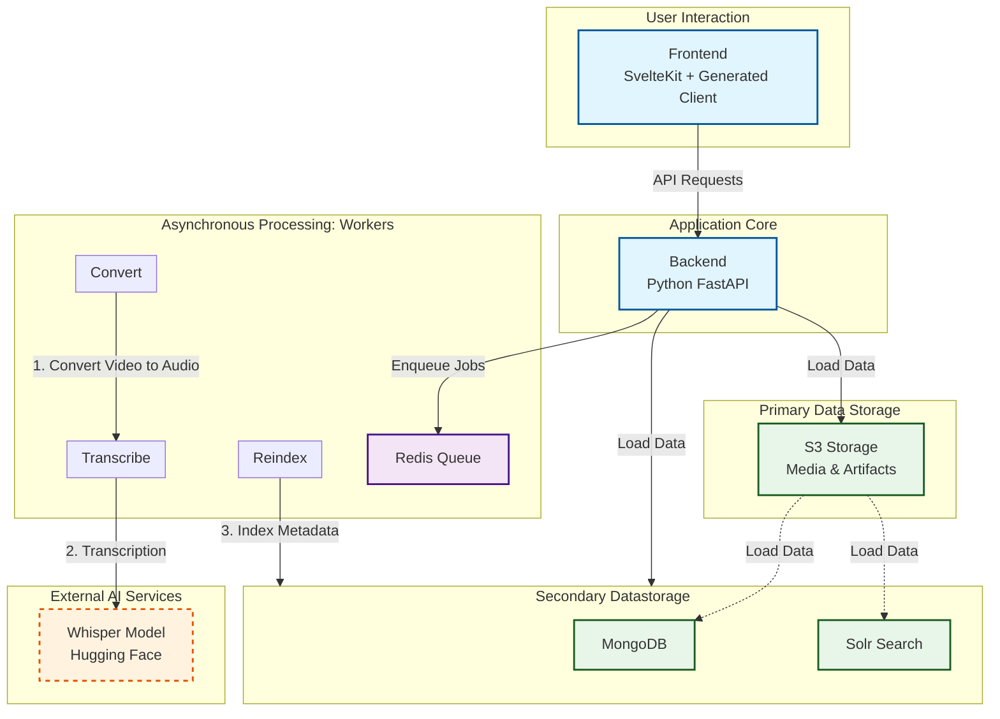
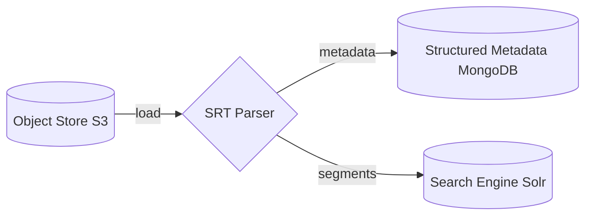
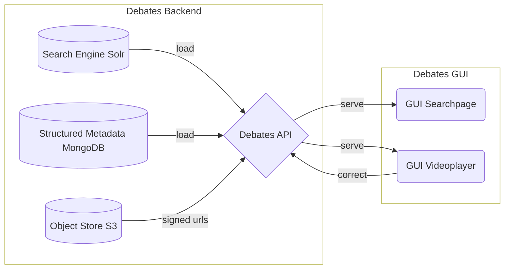

## Architecture

The application consists of the following parts:

- **Frontend**: in svelte kit with a generated API client (generated from the
  backend)

- **Backend**: in python with a FastAPI interface: all actions happen here and
  can be started either via the frontend or per API

- **Workers**: via redis queue: to decouple the time consuming processing from
  access requests on the data and metadata a redis queue has been established to
  pipe the uploaded media files through a pipeline of workers, that convert
  videos to audio, derive the transcripts and translations via an external
  interface to an AI tool, stored on Hugging Face. After processing the data is
  stored on an S3 and then loaded into secondary data storages such as Mongo DB
  and Solr

- **Whisper**: the external Whisper component that is accessed via API to do the
  hard work of transcribing the videos is hosted on Hugging Face. A personal
  Hugging Face account and token is needed to gain access for the processing of
  the media files

- [**loading results into secondary databases**](dataloader.md): the processed
  data is loaded into structured databases to improve findability

- [**serving and enriching metadata via a WebUI**](webui.md): the Webui allows
  to search in the debates and to annotate and correct the speaker statements

