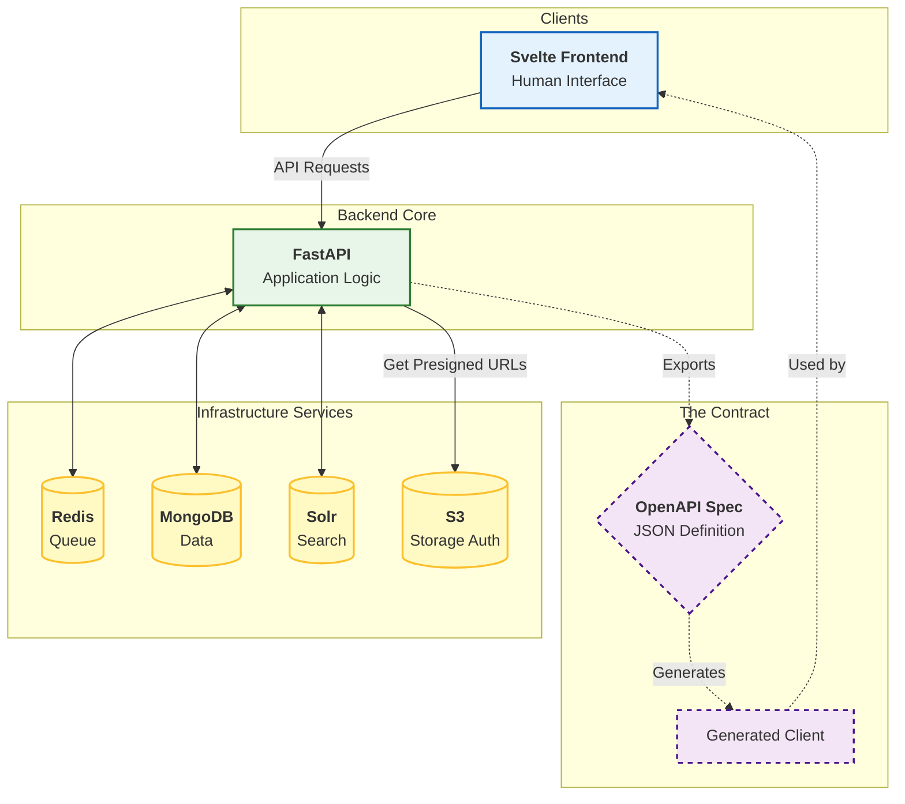

# Application Architecture

The application is built on a modern, decoupled stack separating the User Interface (SvelteKit) from the Core Logic (FastAPI).

!!! abstract "Overview"
    * **Frontend:** SvelteKit (Dumb Client).
    * **Backend:** FastAPI (Single Source of Truth).
    * **Interface:** Strictly typed OpenAPI contract.
    * **Connectivity:** The Backend orchestrates all services (DB, Queue, Storage); the Frontend (mostly) talks only to the Backend.
    * **Authentication:** Role logic (`reader`/`editor`) is handled via routes in the core app, intended to be protected by an upstream proxy (Nginx).

---

## Architecture Diagram

This diagram shows how the **OpenAPI Spec** acts as the glue between the two layers, ensuring the frontend is always in sync with the backend capabilities.

## API-First Design

The application follows a strict Dual Interface philosophy. All functionality is exposed via the API first.

* Machine Interface: Scripts or third-party tools can trigger analysis, search data, or manage files directly via the API.

* Human Interface: The Frontend is simply a consumer of this API. It is kept "dumb," containing minimal business logic.

To ensure consistency, we generate a TypeScript client directly from the FastAPI OpenAPI specification. This guarantees that if the Backend changes, the Frontend build will fail if it is not updated, preventing runtime errors.

## 2. Backend Orchestration

The Backend is the central nervous system. It has privileged access to the infrastructure components:

* Redis: Pushes jobs to the processing queue.

* MongoDB & Solr: Reads and writes persistent data.

* S3: Generates Presigned URLs to delegate file transfer permissions to the frontend.

## 3. Authentication & Roles

The core application is designed to run behind a secure proxy (like Nginx). Therefore, it implements a lightweight role-switching mechanism internally:

* Reader Role: The default view (Search & Playback).

* Editor Role: Access to metadata editing and file management.

!!! info "Dev vs. Prod Auth"
    * In Development: You can switch roles simply by navigating to the /edit route or clicking "Logout."
    * In Production: The Nginx proxy handles the actual password verification before the request even reaches the application, ensuring that only authorized users can access the /edit routes.
