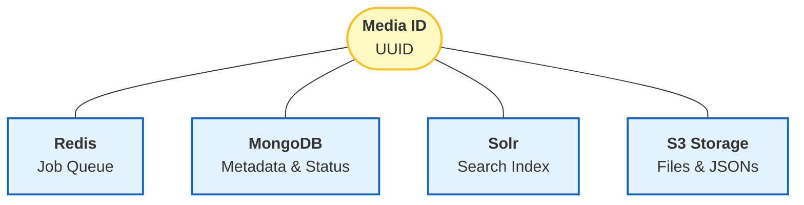
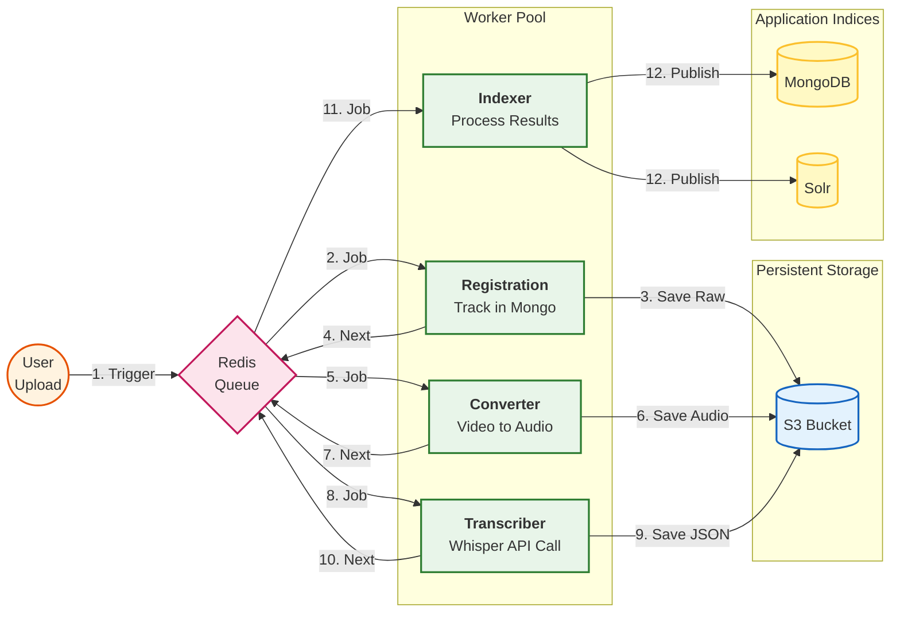

# Processing Architecture

The processing system is an event-driven pipeline coordinated by a Redis queue. It ensures that heavy tasks (conversion, transcription) are handled asynchronously and reliably.

!!! abstract "Overview"
    * **Control Plane:** A Redis queue orchestrates all background jobs.
    * **Identity:** Every file is assigned a unique `media_id` (UUID) which links data across S3, MongoDB, and Solr.
    * **Workflow:** Upload :material-arrow-right: Convert :material-arrow-right: Transcribe :material-arrow-right: Index.
    * **Monitoring:** The Dashboard tracks job status, history, and errors in real-time.

---

## 1. The Media ID (UUID)

The `media_id` is the backbone of the system. It acts as the primary key that ties together the disparate storage systems. This ensures that when you delete or re-index a file, the system knows exactly which assets belong together.

### Data Linkage Diagram



## 2. The Processing Pipeline

The pipeline is triggered automatically upon upload. Intermediate results are constantly saved to the S3 "Vault" to prevent data loss, while Redis handles the communication between workers.
Pipeline Flow Diagram



## 3. Monitoring & Error Handling

### Dashboard Tracking

The frontend Dashboard provides a real-time view of the processing queue.

* History: You can view the complete log of steps (e.g., "Conversion started," "Conversion finished").

* Errors: If a worker fails, the error message is captured and displayed.

!!! failure "Recovery Strategy"
    If a job fails (marked in Red), the recommended recovery is currently manual: 1. Delete the failed media entry via the Dashboard. 2. Re-upload the file to restart the pipeline from scratch.

## 4. Indexing

The system supports indexing pre-processed content. If you manually upload valid Whisper outputs to the S3 bucket, the system can ingest them. And you can start indexing via the dashboard:

File structure that is expected:

```title="expected files for a video upload"
   media_dir
    ├── source.mp4
    ├── audio.wav
    └── transcripts
        ├── subtitles-original.json
        └── subtitles-translation.json
```

```title="expected files for a audio upload"
   media_dir
    ├── source.wav
    └── transcripts
        ├── subtitles-original.json
        └── subtitles-translation.json
```

!!! Note
    Currently only the subtitle json files are used for indexing: all other files can be provided
    and will then be downloadable, but are not of operational importance