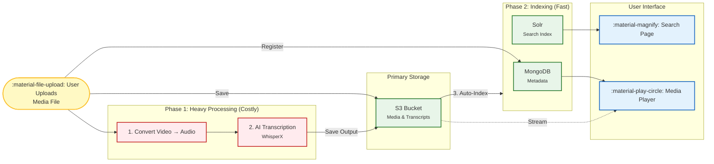
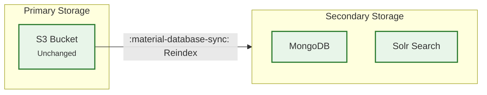

# Dashboard

The dashboard provides editors with tools to manage media files throughout their entire lifecycle—from upload through processing to indexing and deletion.

!!! abstract "Quick Reference"
    **Access Level:** Editor only  
    **Main Functions:** Upload, monitor processing, reindex, and delete media files
    
    | Action | Icon | Description |
    |--------|------|-------------|
    | **Upload** | :material-file-upload-outline: | Add new video/audio files |
    | **Watch** | :material-reload: | Monitor processing status |
    | **Reindex** | :material-database-sync: | Refresh search indexes |
    | **Delete** | :material-trash-can-outline: | Remove media permanently |

---

## Dashboard Overview

{ width="100%" }

---

## How Media Processing Works

Understanding the media processing pipeline helps you manage files effectively.

### Processing Steps

Each uploaded media file goes through this workflow:

1. **Upload** - File uploaded to S3 and registered in MongoDB with unique `media_id`
2. **Heavy Processing** - Conversion and AI transcription (runs in background)
3. **Auto-Indexing** - Results indexed in MongoDB and Solr for search
4. **Available** - Media appears in search and player pages

!!! warning "Supported File Formats"
    Currently only these formats can be processed:
    
    - **Audio:** `.wav` files
    - **Video:** `.mp4` files

---

## :material-file-upload-outline: Upload Media

Add new media files to the system for processing.

### Upload Process

=== "Step 1: Select File"

    Click the upload button and select a media file from your computer.
    
    { width="60%" }

=== "Step 2: Choose Media"

    Browse and select your `.mp4` or `.wav` file.
    
    { width="60%" }

=== "Step 3: Wait for Upload"

    The file will upload to the server. Progress is shown.
    
    { width="60%" }

=== "Step 4: Start Processing"

    Click to initiate the processing pipeline.
    
    { width="60%" }

### After Upload

Your newly uploaded file will appear at the top of the media list on the dashboard:

---

## :material-reload: Monitor Processing Status

Track the progress of media files as they move through the processing pipeline.

### Status Indicators

The dashboard uses color-coded icons to show processing status:

| Status | Indicator | Meaning |
|--------|-----------|---------|
| **Complete** | :material-check-circle:{ style="color: green" } Green | Processing finished successfully |
| **Processing** | :material-clock-start:{ style="color: orange" } Orange | Currently being processed |
| **Failed** | :material-alert-circle:{ style="color: red" } Red | Processing encountered an error |

!!! success "Ready to Use"
    When a media file shows :material-check-circle:{ style="color: green" } **green status**, it's fully indexed and available on the search and player pages.

### Monitoring Tips

- **Reload the page** to update status indicators
- **Failed jobs** (red) may need to be deleted and re-uploaded
- **Processing time** varies based on media length and queue

---

## :material-database-sync: Reindex Media

Refresh the search indexes without reprocessing the original media file.

### When to Reindex

Use reindexing in these situations:

!!! info "Common Reindex Scenarios"
    
    - **Schema Changes** - After updating Solr or MongoDB metadata structure
    - **Manual Uploads** - After manually adding WhisperX results to S3
    - **Index Corruption** - When search results seem incomplete or incorrect
    - **Metadata Updates** - After modifying how metadata is extracted

### How Reindexing Works

**What reindexing does:**

- ✓ Reads existing data from S3 (primary storage)
- ✓ Updates MongoDB and Solr (secondary storage)
- ✗ Does NOT reprocess the original media
- ✗ Does NOT re-run transcription

### Reindex a File

Click the **:material-database-sync: Re-index** button next to any media file in the dashboard:

!!! tip "Fast Operation"
    Reindexing is much faster than full processing since it only updates the indexes from existing data.

---

## :material-trash-can-outline: Delete Media

Permanently remove media files from the entire system.

### What Gets Deleted

When you delete a media file, it is removed from **all storage layers**:

| Storage Layer | Data Removed |
|---------------|--------------|
| **S3** | Original media file, transcripts, analysis outputs |
| **MongoDB** | All metadata and document entries |
| **Solr** | Search index entries |

!!! danger "Permanent Action"
    **Deletion cannot be undone.** All data associated with the media file will be permanently lost.

### When to Delete

Consider deleting media in these cases:

- **Failed Processing** - Jobs that repeatedly fail and can't be recovered
- **Duplicate Uploads** - Accidentally uploaded the same file multiple times
- **Test Files** - Media uploaded for testing that's no longer needed
- **Incorrect Files** - Wrong media uploaded by mistake

### Delete a File

Click the **:material-trash-can-outline: Delete** icon next to the media file you want to remove.

!!! warning "Confirmation Required"
    You'll be asked to confirm before deletion proceeds. Double-check the file before confirming.

---

## Next Steps

After uploading and processing your media:

- **Search for content** using the [Search Page](searchpage.md)
- **Watch and analyze** media on the [Media Player](mediaplayer.md)
- **Manage metadata** in the player interface
