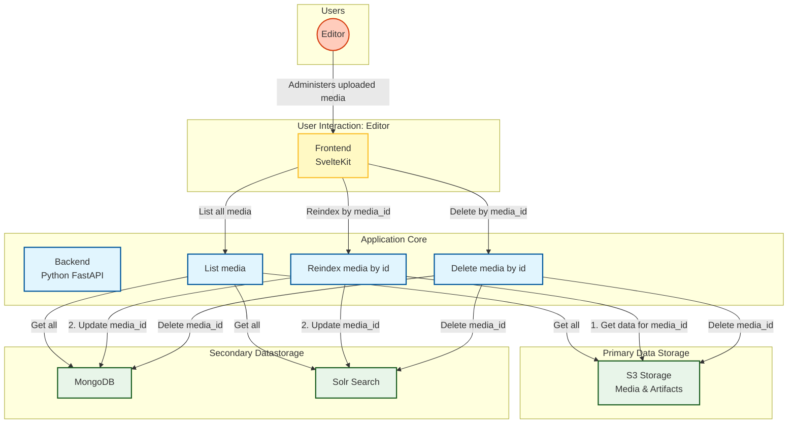

```mermaid
graph TD
    subgraph Users ["Users"]
        User((Editor))
    end

    subgraph Clients ["User Interaction: Editor"]
        FE[Frontend<br>SvelteKit]
    end

    subgraph App_Layer ["Application Core"]
        BE[Backend<br>Python FastAPI]

        %% logical steps inside backend
        List[List media]
        Delete[Delete media by id]
        Reindex[Reindex media by id]
    end

    subgraph Storage1 ["Primary Data Storage"]
        S3[S3 Storage<br>Media & Artifacts]
    end

    subgraph Storage2 ["Secondary Datastorage"]
        Mongo[MongoDB]
        Solr[Solr Search]
    end


    %% --- Relationships ---

    %% User Action
    User -->|Administers uploaded media| FE

    %% List Flow
    FE -->|List all media | List
    List -- Get all --> Mongo
    List -- Get all --> Solr
    List -- Get all --> S3

    %% Reindex Flow
    FE -->|Reindex by media_id | Reindex
    Reindex -- 1. Get data for media_id --> S3
    Reindex -- 2. Update media_id --> Mongo
    Reindex -- 2. Update media_id --> Solr

    %% Delete Flow
    FE -->|Delete by media_id | Delete
    Delete -- Delete media_id --> Mongo
    Delete -- Delete media_id --> Solr
    Delete -- Delete media_id --> S3

    %% --- Styling ---
    classDef primary fill:#e1f5fe,stroke:#01579b,stroke-width:2px;
    classDef secondary fill:#f3e5f5,stroke:#4a148c,stroke-width:2px;
    classDef storage fill:#e8f5e9,stroke:#1b5e20,stroke-width:2px;
    classDef external fill:#fff3e0,stroke:#e65100,stroke-width:2px,stroke-dasharray: 5 5;
    classDef client fill:#fff9c4,stroke:#fbc02d,stroke-width:2px;
    classDef user fill:#ffccbc,stroke:#d84315,stroke-width:2px;

    class FE client;
    class BE,List,Reindex,Delete primary;
    class S3,Mongo,Solr storage;
    class User user;
```
