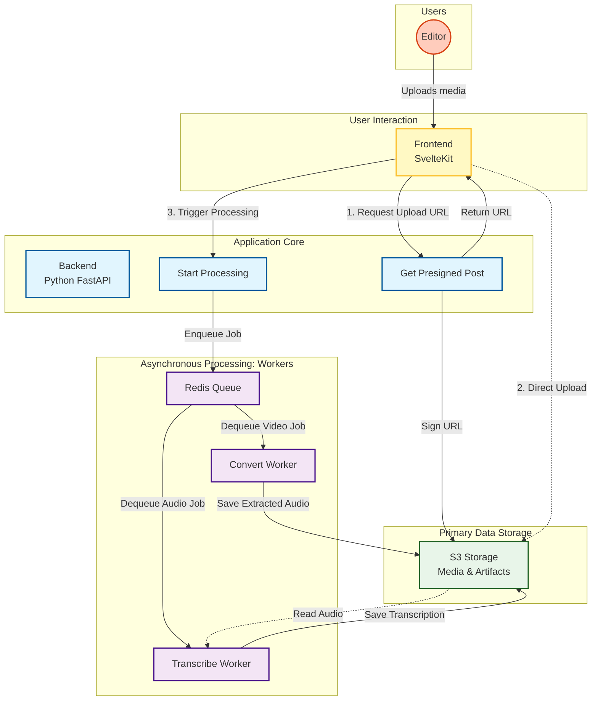

```mermaid
graph TD
    subgraph Users ["Users"]
        User((Editor))
    end

    subgraph Clients ["User Interaction"]
        FE[Frontend<br>SvelteKit]
    end

    subgraph App_Layer ["Application Core"]
        BE[Backend<br>Python FastAPI]

        %% logical steps inside backend
        GetUrl[Get Presigned Post]
        Process[Start Processing]
    end

    subgraph Async_Layer ["Asynchronous Processing: Workers"]
        Redis[Redis Queue]
        Converter["Convert Worker"]
        Transcriber["Transcribe Worker"]
    end

    subgraph Storage1 ["Primary Data Storage"]
        S3[S3 Storage<br>Media & Artifacts]
    end

    %% --- Relationships ---

    %% User Action
    User -->|Uploads media| FE

    %% 1. Upload Flow
    FE -->|1. Request Upload URL| GetUrl
    GetUrl -- Sign URL --> S3
    GetUrl -->|Return URL| FE
    FE -.->|2. Direct Upload| S3

    %% 2. Processing Flow
    FE -->|3. Trigger Processing| Process
    Process -->|Enqueue Job| Redis

    %% 3. Async Execution
    Redis -->|Dequeue Video Job| Converter
    Redis -->|Dequeue Audio Job| Transcriber

    %% 4. Worker Actions
    Converter -->|Save Extracted Audio| S3

    %% Transcriber reads the audio converted by the previous step
    S3 -.->|Read Audio| Transcriber
    Transcriber -->|Save Transcription| S3

    %% --- Styling ---
    classDef primary fill:#e1f5fe,stroke:#01579b,stroke-width:2px;
    classDef secondary fill:#f3e5f5,stroke:#4a148c,stroke-width:2px;
    classDef storage fill:#e8f5e9,stroke:#1b5e20,stroke-width:2px;
    classDef external fill:#fff3e0,stroke:#e65100,stroke-width:2px,stroke-dasharray: 5 5;
    classDef client fill:#fff9c4,stroke:#fbc02d,stroke-width:2px;
    classDef user fill:#ffccbc,stroke:#d84315,stroke-width:2px;

    class FE client;
    class BE,GetUrl,Process primary;
    class Redis,Converter,Transcriber secondary;
    class S3 storage;
    class User user;
```
