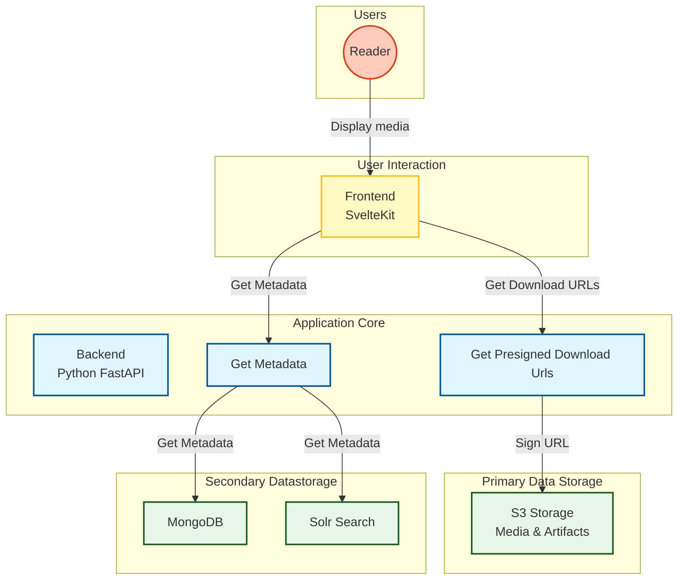

```mermaid
graph TD
    subgraph Users ["Users"]
        User((Reader))
    end

    subgraph Clients ["User Interaction"]
        FE[Frontend<br>SvelteKit]
    end

    subgraph App_Layer ["Application Core"]
        BE[Backend<br>Python FastAPI]

        %% logical steps inside backend
        GetUrls[Get Presigned Download Urls]
        GetMetadata[Get Metadata]
    end

    subgraph Storage1 ["Primary Data Storage"]
        S3[S3 Storage<br>Media & Artifacts]
    end

    subgraph Storage2 ["Secondary Datastorage"]
        Mongo[MongoDB]
        Solr[Solr Search]
    end

    %% --- Relationships ---

    %% User Action
    User -->|Display media| FE

    %% Mediaplayer
    FE -->|Get Download URLs| GetUrls
    FE -->|Get Metadata| GetMetadata
    GetUrls -- Sign URL --> S3
    GetMetadata -->|Get Metadata| Mongo
    GetMetadata -->|Get Metadata| Solr

    %% --- Styling ---
    classDef primary fill:#e1f5fe,stroke:#01579b,stroke-width:2px;
    classDef secondary fill:#f3e5f5,stroke:#4a148c,stroke-width:2px;
    classDef storage fill:#e8f5e9,stroke:#1b5e20,stroke-width:2px;
    classDef external fill:#fff3e0,stroke:#e65100,stroke-width:2px,stroke-dasharray: 5 5;
    classDef client fill:#fff9c4,stroke:#fbc02d,stroke-width:2px;
    classDef user fill:#ffccbc,stroke:#d84315,stroke-width:2px;

    class User user;
    class FE client;
    class BE,GetUrls,GetMetadata primary;
    class S3,Mongo,Solr storage;
```
