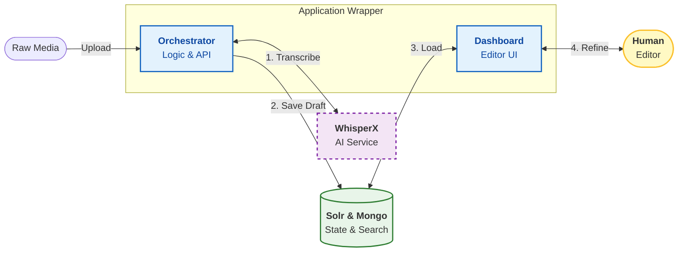
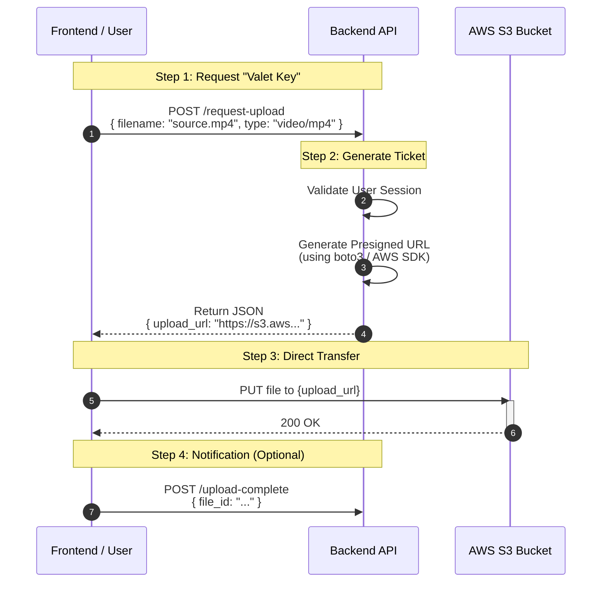
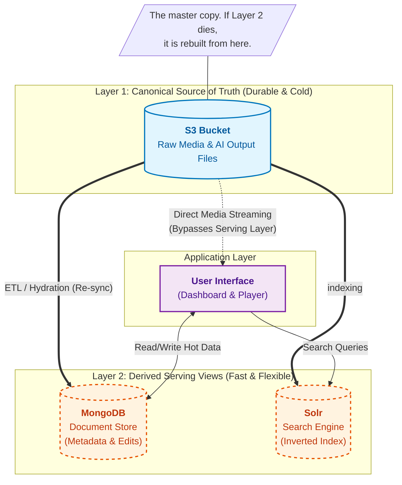
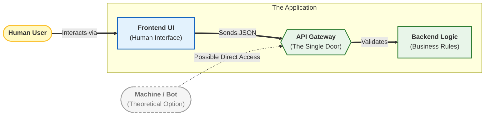

# Mermaid diagrams that are used on the poster

## AI Orchestration and Human in the loop

```mermaid
graph LR
    %% --- Subgraphs & Nodes ---
    Input([Raw Media])

    subgraph Wrapper ["Application Wrapper"]
        direction TB
        Logic[<b>Orchestrator</b><br>Logic & API]
        UI[<b>Dashboard</b><br>Editor UI]
    end

    AI[<b>WhisperX</b><br>AI Service]
    Store[("<b>Solr & Mongo</b><br>State & Search")]
    Human([<b>Human</b><br>Editor])

    %% --- Flow: Left to Right ---

    %% 1. Ingest & AI
    Input -->|Upload| Logic
    Logic <-->|1. Transcribe| AI

    %% 2. Persistence
    Logic -->|2. Save Draft| Store

    %% 3. The Human Loop (The Cycle)
    Store <-->|3. Load| UI
    UI <-->|4. Refine| Human

    %% --- Styling ---
    classDef wrap fill:#e3f2fd,stroke:#1565c0,stroke-width:2px,color:#0d47a1
    classDef ai fill:#f3e5f5,stroke:#7b1fa2,stroke-width:2px,stroke-dasharray: 5 5
    classDef store fill:#e8f5e9,stroke:#2e7d32,stroke-width:2px
    classDef human fill:#fff9c4,stroke:#fbc02d,stroke-width:2px

    class Logic,UI wrap
    class AI ai
    class Store store
    class Human human
```

## Presigned Urls

```mermaid
sequenceDiagram
    autonumber
    participant Client as Frontend / User
    participant Server as Backend API
    participant S3 as AWS S3 Bucket

    Note over Client, Server: Step 1: Request "Valet Key"
    Client->>Server: POST /request-upload<br/>{ filename: "source.mp4", type: "video/mp4" }

    Note over Server: Step 2: Generate Ticket
    Server->>Server: Validate User Session
    Server->>Server: Generate Presigned URL<br/>(using boto3 / AWS SDK)

    Server-->>Client: Return JSON<br/>{ upload_url: "https://s3.aws..." }

    Note over Client, S3: Step 3: Direct Transfer
    Client->>S3: PUT file to {upload_url}
    activate S3
    S3-->>Client: 200 OK
    deactivate S3

    Note over Client, Server: Step 4: Notification (Optional)
    Client->>Server: POST /upload-complete<br/>{ file_id: "..." }
```

## Double Layer Datastorage

```mermaid
graph TD
    %% --- Definitions & Styling ---
    classDef source fill:#e1f5fe,stroke:#0277bd,stroke-width:2px,color:#01579b;
    classDef serving fill:#fff3e0,stroke:#e65100,stroke-width:2px,stroke-dasharray: 5 5,color:#bf360c;
    classDef app fill:#f3e5f5,stroke:#7b1fa2,stroke-width:2px,color:#4a148c;

    %% --- Layer 1: The Foundation ---
    note1[/"The master copy. If Layer 2 dies,<br/>it is rebuilt from here."/]

    subgraph Layer1 ["Layer 1: Canonical Source of Truth (Durable & Cold)"]
        S3[("<b>S3 Bucket</b><br>Raw Media & AI Output Files")]:::source
    end

    %% --- Layer 2: The Serving Infrastructure ---
    subgraph Layer2 ["Layer 2: Derived Serving Views (Fast & Flexible)"]
        Mongo[("<b>MongoDB</b><br>Document Store<br>(Metadata & Edits)")]:::serving
        Solr[("<b>Solr</b><br>Search Engine<br>(Inverted Index)")]:::serving
    end

    %% --- The Application ---
    subgraph UserFacing ["Application Layer"]
        UI["<b>User Interface</b><br>(Dashboard & Player)"]:::app
    end

    %% --- Relationships ---

    %% The Hydration Flow (Heavy Lifting)
    S3 ==>|"ETL / Hydration (Re-sync)"| Mongo
    S3 ==>|"indexing"| Solr

    %% Operational Flows (Fast Interactions)
    UI <-->|"Read/Write Hot Data"| Mongo
    UI -->|"Search Queries"| Solr

    %% The Bypass (Streaming)
    S3 -.->|"Direct Media Streaming<br>(Bypasses Serving Layer)"| UI

    %% Fix layout ordering constraints
    note1 --- S3
```

## API First

```mermaid
graph LR
    %% --- Styling ---
    classDef actor fill:#fff9c4,stroke:#fbc02d,stroke-width:2px;
    classDef future fill:#f5f5f5,stroke:#9e9e9e,stroke-width:2px,stroke-dasharray: 5 5,color:#757575;
    classDef ui fill:#e3f2fd,stroke:#1565c0,stroke-width:2px;
    classDef backend fill:#e8f5e9,stroke:#2e7d32,stroke-width:2px;

    %% --- ACTORS (No Wrapper) ---
    Human(["<b>Human User</b>"]):::actor
    Machine(["<b>Machine / Bot</b><br>(Theoretical Option)"]):::future

    %% --- THE SYSTEM ---
    subgraph System ["The Application"]
        direction LR

        %% The Interface
        UI["<b>Frontend UI</b><br>(Human Interface)"]:::ui

        %% The Core
        API{{"<b>API Gateway</b><br>(The Single Door)"}}:::backend
        Logic["<b>Backend Logic</b><br>(Business Rules)"]:::backend
    end

    %% --- FLOWS ---

    %% 1. The Active Path (Solid Lines)
    Human ==>|"Interacts via"| UI
    UI ==>|"Sends JSON"| API
    API ==>|"Validates"| Logic

    %% 2. The Potential Path (Dotted Line)
    Machine -.->|"Possible Direct Access"| API
```
