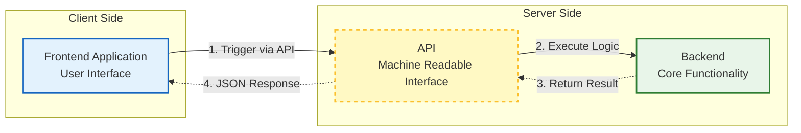

# API Documentation

The API provides a machine readable interface to the application: all functionality is provided by the backend and can be triggered via the API by the frontend.

## Structure

The API routes are structured into groups:

- **Ingestion**: Upload media files and start the processing
- **Admin**: Administer the uploaded media: allows to reindex and delete a media item together with its derived results
- **Metadata**: Display and update metadata on the speakers and debate, correct the AI derived transcriptions and translations
- **Search**: Fulltext search in speaker statements

## API Spec

<swagger-ui src="./openapi.json"/>
