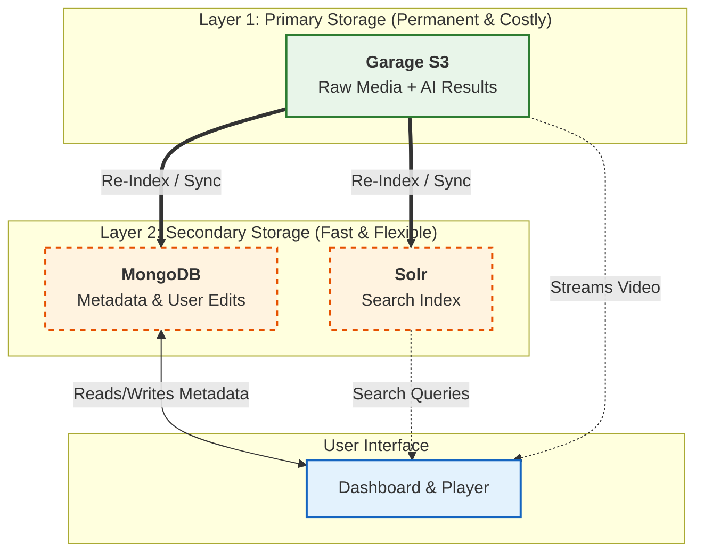

# Data Storage Architecture

!!! abstract "Overview"
    * **Architecture:** A dual-layer system that separates long-term storage from application performance.
    * **Primary Store (The Vault):** S3/Garage stores the raw media and expensive AI results (permanent).
    * **Secondary Store (The Index):** MongoDB and Solr store metadata and search indices (fast & flexible).
    * **Strategy:** Ensures costly data is safe while allowing the application index to be rebuilt ("re-indexed") at any time.

## Architecture

The system uses a **Dual-Layer** storage strategy to balance data safety with application performance.

## Primary Storage (The "Vault")
* **Technology:** S3-compatible Object Store (via [Garage](https://garagehq.deuxfleurs.fr/))
* **Purpose:** Long-term preservation of costly data.
* **Content:** Raw media files (`.mp4`, `.wav`) and the expensive AI outputs (WhisperX JSONs, SRTs).
* **Philosophy:** This layer is treated as the "Single Source of Truth." Since generating transcripts takes significant GPU time and money, this data is stored permanently and safely here.

## Secondary Storage (The "Index")
* **Technology:** [MongoDB](https://www.mongodb.com/) & [Apache Solr](https://solr.apache.org/)
* **Purpose:** Fast access and flexibility for the User Interface.
* **Content:**
    * **MongoDB:** Tracks processing status, user edits, and metadata corrections.
    * **Solr:** Provides sub-second full-text search across millions of speaker statements.
* **Philosophy:** This layer is "derived." It can be wiped and rebuilt (re-indexed) at any time using the data from the Primary Storage. This allows you to change your database schema or search logic without ever losing the original AI transcriptions.

---

## Data Flow Diagram

This diagram illustrates how the costly data is safely isolated, while the secondary storage acts as a flexible cache for the application.

## Strategy

!!! tip "Production Advice: Choose Stable S3"
    In a production environment, the **Primary Storage** is your most critical asset. If you lose this data, you lose the expensive compute results.

    * **Recommendation:** Replace the local Garage container with a managed S3 service (e.g., AWS S3, MinIO Cluster) or ensure your hosting volume has rigorous daily backups.
    * **Contrast:** The **Secondary Storage** (MongoDB/Solr) is less critical. It can be treated as "part of the app"—if it fails, you can simply spin up empty databases and re-index everything from your safe Primary Storage.
