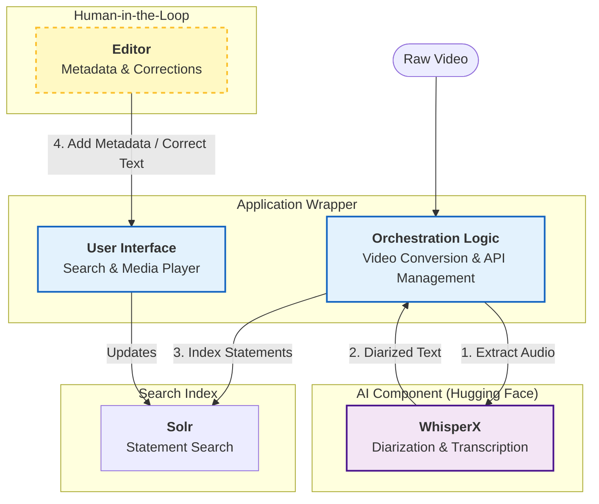

# Application Architecture

The **Political Debates** application acts as a comprehensive wrapper and orchestration layer around advanced AI components. Its primary goal is to transform raw media into searchable, speaker-aware knowledge.

!!! abstract "Overview"
    * **Core Concept:** An orchestration wrapper around Hugging Face AI components.
    * **Primary Output:** "Speaker Statements"—identifying exactly *who* said *what* and *when*.
    * **Human-in-the-Loop:** A dedicated interface for Editors to add missing metadata and correct AI inaccuracies.
    * **Search & Discovery:** A Solr-backed engine to filter statements by speaker, topic, or keyword.

---

## System Context Diagram

This diagram illustrates how the application "wraps" the raw AI processing to add value through storage, search, and human editing.

## Core Functionality

### 1. The Wrapper Concept

The application does not perform the heavy machine learning itself. Instead, it serves as a bridge (wrapper) to Hugging Face:

* It handles video input by first converting it to audio.

* It sends this audio to the AI component (WhisperX).

* It retrieves and stores the results.

### 2. Speaker Statements

The main value proposition of the system is the derivation of Speaker Statements. Unlike simple subtitles, the analysis breaks content down by speaker. This structure is what enables the central query: "Who said what, and when?"

### 3. Human-in-the-Loop

While the AI provides the text, it cannot know the context (e.g., the specific name of a politician or the date of the debate) derived purely from audio.

* Metadata Injection: Editors manually provide context that the audio lacks.

* Correction: Editors use the interface to fix transcription errors or misattributed speakers.

!!! tip "Future Roadmap"
    In later versions, this manual step could be further automated. For example, Face Recognition could identify speakers visually, or scrapers could pull metadata directly from official debate websites.
    User Interface Components

## User Interface Components

To make this data accessible, the application provides two key views:

* [Search Page](../userguide/searchpage.md): Powered by Solr, this allows users to filter statements by metadata tags (e.g., Topic, Date) or search for specific text phrases.

* [Media Player](../userguide/mediaplayer.md): A specialized tool for playback and editing. It allows the Editor to watch the video while simultaneously correcting the transcript and metadata in real-time.

## Techstack

For the exact techstack see [Installations: Techstack](../installation/overview.md#stack-components).

## Components and Design Principles

* [**Application**](application.md): The Application design follows an API first pattern, where the Frontend is dumb and the API is the interface to processing.
* [**Datastorage**](datastorage.md): A dual-layer storage system separates long-term storage from a short term storage that can be quickly adapted to application needs.
* [**Whisper**](whisperx.md): An external AI on hugging face is accessed via API and does the heavy lifting to extract speaker statements, languages and translations form the media inputs.
* [**Processing Pipeline**](processing.md): Processing is guided by a unique `media_id` that allows to track processing, data and metadata in the various components of the system
* [**Presigned Urls**](presigned-urls.md): The frontend has no credentials for the primary datastorage on S3 and uses presigned urls to upload, stream and download from there.
