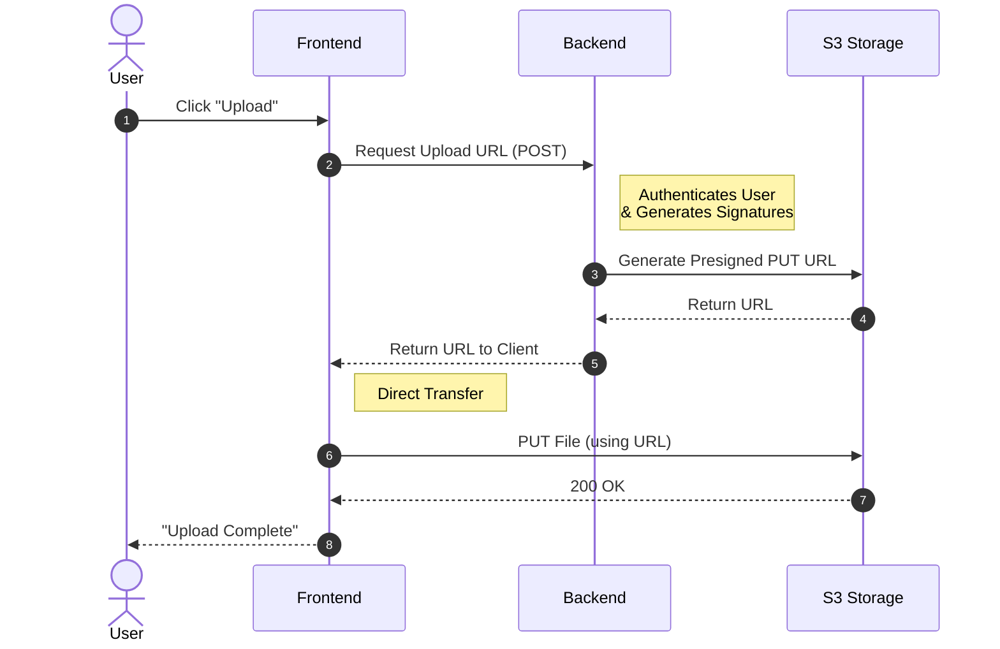
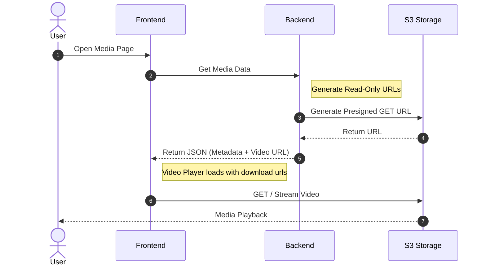

# Storage Access: Presigned URLs

The application uses **Presigned URLs** to handle large file transfers. This pattern allows the Frontend to communicate directly with the S3 storage, bypassing the Backend for the heavy data transfer while keeping credentials secure.

!!! abstract "Overview"
    * **Mechanism:** Direct S3 access via temporary, time-limited URLs.
    * **Security:** The Backend holds the master secrets; the Frontend only receives a temporary "key" (the URL).
    * **Efficiency:** Files are not buffered on the Backend, reducing server load and latency.
    * **Scope:** Used for Uploads, Downloads, and Media Streaming.

---

## 1. File Upload Flow

When a user uploads a file, the file data never touches the Backend server. Instead, the Frontend asks for permission, receives a specific "upload address," and sends the file directly to the storage.

### Key Steps

1. **Request**: The user initiates an upload. The Frontend requests a "slot" from the Backend.

2. **Authorization**: The Backend validates the user's permissions and generates a specific URL valid for a PUT operation on a specific filename.

3. **Transfer**: The Frontend uses this URL to upload the binary data directly to S3.

## 2. Download & Streaming Flow

For viewing videos or downloading transcripts, the process happens automatically when the page loads.
Code-Snippet

### Key Steps

1. **Page Load**: When the user opens a debate page, the Frontend requests the media details.

2. **Generation**: The Backend generates a GET URL (often with a short expiration time) that allows reading that specific file.

3. **Playback**: The video player in the browser uses this URL as the src source, streaming bytes directly from S3.

## Why this Architecture?

:shield: Security

The Frontend never holds permanent credentials (API Keys or Secrets). It only holds a URL that is valid for a short time and a single action. If a URL leaks, it expires quickly and cannot be used to access other files.

:rocket: Performance

If we routed files through the Backend, the server would have to read the file from S3 and write it to the user simultaneously (Acting as a proxy). This doubles the bandwidth usage and occupies server memory. Presigned URLs offload this work entirely to the S3 provider.
