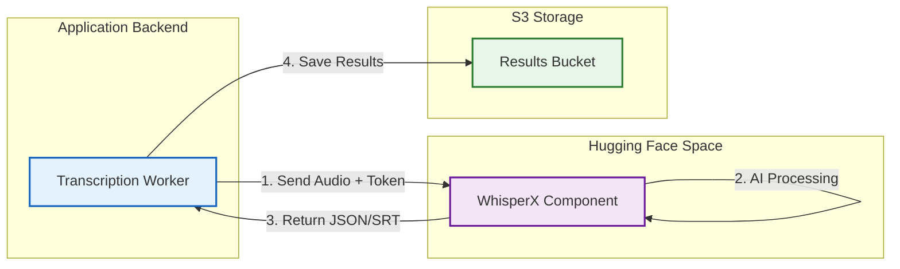

# WhisperX Processing

WhisperX provides AI-powered speech-to-text with speaker identification (diarization), handled externally via a Hugging Face Space component.

!!! abstract "Overview"
    * **What:** AI transcription & speaker identification (diarization).
    * **Where:** External processing via Hugging Face Space.
    * **Requires:** Hugging Face Account + API Token.

## Integration Architecture

The application offloads heavy AI processing to an external Hugging Face Space. This allows for high-quality transcription without requiring powerful local GPUs.



---

## Capabilities

WhisperX combines two AI models to provide a complete transcript:

| Feature | Model | Output |
| --- | --- | --- |
| **Speaker Detection** | `pyannote.audio` | Identifies speakers turns. |
| **Transcription** | `OpenAI Whisper` | Converts speech to text (Multi-language) and offers transcription and translation modes. |

### Output Format

The result is a standard `.srt` subtitle file containing both the text and the speaker labels (e.g., `[SPEAKER_01]: Hello world`).

---

## Configuration

To enable this feature, you must configure your credentials.

### 1. Accept Model Terms

You **must** visit these pages and accept the terms of use, or the API will fail:

* [pyannote/speaker-diarization-3.1](https://huggingface.co/pyannote/speaker-diarization-3.1)
* [pyannote/segmentation-3.0](https://huggingface.co/pyannote/segmentation-3.0)

### 2. Get API Token

1. Go to [Hugging Face Settings](https://huggingface.co/settings/tokens).
2. Create a **New Token** with `Read` permissions.

### 3. Update Environment

Add your token to `config/.env.secret`:

```ini title="config/.env.secret"
HF_TOKEN=hf_your_token_here
```

The `.env` specifies space and model:

```ini title="config/.env"
# Recommended Models: large-v2 or large-v3
HF_MODEL=large-v3
HF_SPACE_URL=https://katospiegel-odtp-pyannote-whisper.hf.space/
```

!!! warning "Model Selection"
    Use only `large-v2` or `large-v3`. Smaller models may cause reindex errors since the output will be of poor quality then.

---

## Advanced Usage

While the application handles processing automatically, you can also process files manually if needed (e.g., for testing or batch imports).

!!! tip "Manual Upload"
    You can run WhisperX manually via the [Hugging Face UI](https://katospiegel-odtp-pyannote-whisper.hf.space/) and then import the resulting files using the [CLI](../development/cli.md). But this is not not recommended and involves some manual file renaming at the current time.
