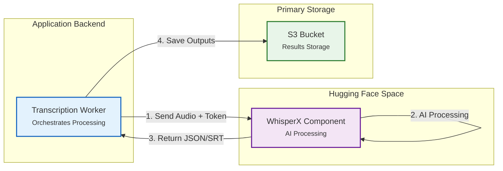
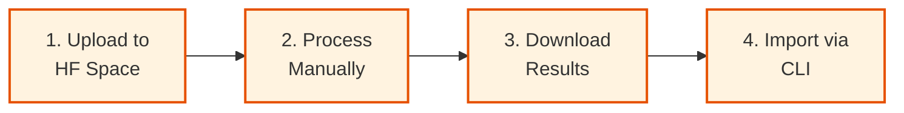

# WhisperX Processing

WhisperX handles the heavy lifting of audio transcription and speaker diarization through an external Hugging Face component, providing AI-powered speech-to-text with speaker identification.

!!! abstract "Overview"
    **What:** AI transcription and speaker diarization powered by WhisperX
    **Where:** External processing via Hugging Face Space
    **Requirements:** Hugging Face account, API token, model acceptance

    | Topic | Description |
    |-------|-------------|
    | **Integration** | How the app connects to Hugging Face |
    | **Capabilities** | Transcription, translation, and speaker detection |
    | **Setup** | Required configuration steps |
    | **Advanced** | Manual processing and CLI import |

---

## Integration Architecture

The application delegates transcription processing to an external Hugging Face Space component, enabling powerful AI capabilities without requiring local GPU resources.



### How It Works

1. **Application sends** audio file and API credentials to Hugging Face
2. **WhisperX processes** with AI models (GPU-accelerated)
3. **Results return** as structured JSON and SRT subtitle files
4. **Data stored** in S3 for indexing and playback

!!! info "External Processing"
    Processing happens on Hugging Face infrastructure, not on your server. This offloads GPU requirements while providing professional-grade transcription.

---

## API Access Interface

The Hugging Face Space provides both programmatic API access (used by the application) and an interactive web interface for manual processing.


---

## WhisperX Capabilities

### Processing Features

WhisperX combines multiple AI models to provide comprehensive audio analysis:

| Feature | Model | Output |
|---------|-------|--------|
| **Speaker Detection** | pyannote.audio | Identifies unique speakers |
| **Speaker Segmentation** | pyannote.audio | Timestamps for speaker turns |
| **Speech Recognition** | OpenAI Whisper | Transcribed text per segment |
| **Translation** | OpenAI Whisper | Translated text (optional) |

### Processing Modes

=== "Transcribe"

    **What:** Convert speech to text in the original language
    
    **Process:**
    
    1. Detect and segment speakers with pyannote.audio
    2. Transcribe each segment with OpenAI Whisper
    3. Generate timestamped, speaker-labeled subtitles
    
    **Use for:** Creating transcripts with speaker identification

=== "Translate"

    **What:** Convert speech to English text (regardless of source language)
    
    **Process:**
    
    1. Detect and segment speakers with pyannote.audio
    2. Translate each segment to English with OpenAI Whisper
    3. Generate timestamped, speaker-labeled subtitles
    
    **Use for:** Making non-English content accessible in English

### Output Format

The final output is diarized subtitles that capture both speech content and speaker turns:


**Features:**

- Timestamp for each segment
- Speaker labels (SPEAKER_00, SPEAKER_01, etc.)
- Transcribed or translated text
- Standard SRT subtitle format

---

## Configuration Requirements

To use WhisperX processing, you must configure your Hugging Face credentials and accept model terms.

### Step 1: Accept Model Terms

The pyannote.audio models require explicit acceptance of their terms of use:

!!! warning "Required: Accept Model Terms"
    Visit these pages and accept the terms before proceeding:
    
    - [pyannote/speaker-diarization-3.1](https://huggingface.co/pyannote/speaker-diarization-3.1)
    - [pyannote/segmentation-3.0](https://huggingface.co/pyannote/segmentation-3.0)

### Step 2: Generate API Token

Create a Hugging Face access token:

1. Navigate to [Hugging Face Access Tokens](https://huggingface.co/settings/tokens)
2. Click **"New token"**
3. Select **"Read"** permission level
4. Copy the generated token

### Step 3: Configure Environment

Add your credentials to the application environment files:

```ini title="deploy/compose/.env.secrets" hl_lines="2"
# Hugging Face API Token
HF_TOKEN=hf_your_token_here
```

```ini title="deploy/compose/.env"
# WhisperX Model Configuration
HF_MODEL=large-v3
HF_SPACE_URL=https://katospiegel-odtp-pyannote-whisper.hf.space/
```

!!! warning "Model Options"
    This application only supports higher `HF_MODEL` model sizes:`large-v2`, `large-v3`

    As otherwise the speaker diarization might not be synced between translations and transcription and indexing will fail then.

### Step 4: Restart Services

Apply the configuration changes:

```bash
just up --force-recreate backend
```

## Advanced: Manual Processing

For specialized use cases, you can process audio files manually through the Hugging Face interface and import results via CLI.

### When to Use Manual Processing

!!! info "Manual Processing Use Cases"

    - **Testing & Debugging** - Verify processing on specific files
    - **No GPU Resources** - Leverage Hugging Face infrastructure
    - **Batch Processing** - Process multiple files outside the main app
    - **Custom Parameters** - Experiment with different model settings

### Manual Workflow



#### Step 1: Set Up Your Space

**Option A: Use Existing Space**

Access the public space directly: [katospiegel/odtp-pyannote-whisper](https://huggingface.co/spaces/katospiegel/odtp-pyannote-whisper)

**Option B: Clone to Your Account**

1. Visit the space and click **"Duplicate Space"**
2. Clone to your own Hugging Face account
3. Upgrade hardware tier to GPU for faster processing

!!! tip "Hardware Upgrade"
    The default CPU tier is very slow. For production speeds, upgrade the Space settings to a GPU tier (requires Hugging Face subscription).

#### Step 2: Process Your Audio

1. Navigate to the Space interface
2. Upload your `.wav` audio file
3. Select processing task: **Transcribe** or **Translate**
4. Click process and wait for completion


#### Step 3: Download Results

WhisperX generates multiple output files for each input:

| File | Content | Use |
|------|---------|-----|
| `[file]_[task].srt` | Subtitle format | Video players |
| `[file]_[task].json` | Structured data | Application import |
| `[file]_[task]_paragraphs.json` | Paragraph format | Text analysis |
| `[file]_[task].md` | Markdown format | Human reading |

**Example for `interview.wav` with task `transcribe`:**

- `interview_transcribe.srt`
- `interview_transcribe.json`
- `interview_transcribe_paragraphs.json`
- `interview_transcribe.md`

#### Step 4: Import via CLI

Use the command-line interface to import results into the application:

```bash
# Upload the JSON results to the application
just reindex --media-id <media_id>
```
---

## Additional Resources

- **WhisperX Space:** [katospiegel/odtp-pyannote-whisper](https://huggingface.co/spaces/katospiegel/odtp-pyannote-whisper)
- **Source Repository:** [odtp-pyannote-whisper](https://github.com/sdsc-ordes/odtp-pyannote-whisper)
- **Hugging Face Tokens:** [Access Token Settings](https://huggingface.co/settings/tokens)
- **pyannote.audio:** [Speaker Diarization Model](https://huggingface.co/pyannote/speaker-diarization-3.1)
- **OpenAI Whisper:** [Whisper Documentation](https://github.com/openai/whisper)

---

## Next Steps

After configuring WhisperX:

- **Upload media** through the [Dashboard](../userguide/dashboard.md)
- **Monitor processing** status on the dashboard
- **View results** in the [Media Player](../userguide/mediaplayer.md)
- **Search transcripts** using the [Search Page](../userguide/searchpage.md)


Here is the simplified documentation. I have streamlined the "Advanced" section to just the essential hint and link you requested, while keeping the architectural overview clear and concise.
