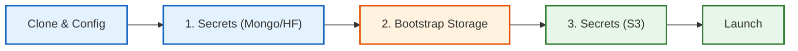

# Core Installation (Docker Compose)

This guide sets up the complete stack (Frontend, Backend, Database, Storage) using Docker Compose.

!!! abstract "Two-Phase Setup Required"
    **Why?** You must start the storage service (Garage) *first* to generate the Access Keys needed by the application.

## 1. Prerequisites

* **Git** & **Bash** terminal
* **Docker** & **Docker Compose**
* **Just** runner ([Installation Guide](https://github.com/casey/just#installation))


## 2. Setup Flow




### Step 1: Initialize Configuration

Clone the repo and create the required environment files.

```bash
git clone git@github.com:sdsc-ordes/debates-analytics.git
cd debates-analytics

# 1. Config for the docker compose
cp config/.env.tmpl config/.env

# 2. Config for Application Secrets
cp config/.env.secrets.tmpl config/.env.secrets

```

**Action:** Open `config/.env.secrets` and fill in the following (leave S3 blank for now):

1. **Mongo Passwords:** Generate random strings (e.g., `openssl rand -hex 4`).
2. **Hugging Face Token:** Your API token for model access.

---

### Step 2: Bootstrap Storage (Generate Keys)

Start the storage service to generate your S3 credentials.

1. **Start Garage:**
```bash
just up garage

```

*(Wait for `Container garage Started`)*

2. **Generate Credentials:**
```bash
just compose exec garage garage key create app-key
```

3. **Copy the Output:**
Note the `Key ID` and `Secret key` from the terminal output.


### Step 3: Finalize & Launch

1. **Update Secrets:** Open `deploy/compose/.env.secrets` again and paste your keys:
```ini
S3_ACCESS_KEY=GK8a...       # Your Key ID
S3_SECRET_KEY=1234...       # Your Secret Key

```


2. **Build and Run:**
```bash
just compose restart garage  # Apply config changes
just build                   # Build images (takes a few mins)
just up                      # Start full stack

```


---

## Verification

Once running, access your services:

| Service | URL | Note |
| --- | --- | --- |
| **Frontend** | [http://localhost:3000](https://www.google.com/search?q=http://localhost:3000) | Main UI |
| **API Docs** | [http://localhost:8082/docs](https://www.google.com/search?q=http://localhost:8082/docs) | Backend Swagger |
| **Logs** | [http://localhost:8080/logs](https://www.google.com/search?q=http://localhost:8080/logs) | Container Logs |
| **Mongo UI** | [http://localhost:8081](https://www.google.com/search?q=http://localhost:8081) | Use credentials from `.env.secrets` |

!!! success "Next Steps"
* **Local Use:** Go to the [User Guide](https://www.google.com/search?q=../userguide/roles.md).
* **Public Access:** Continue to [Server Configuration](https://www.google.com/search?q=server.md).
