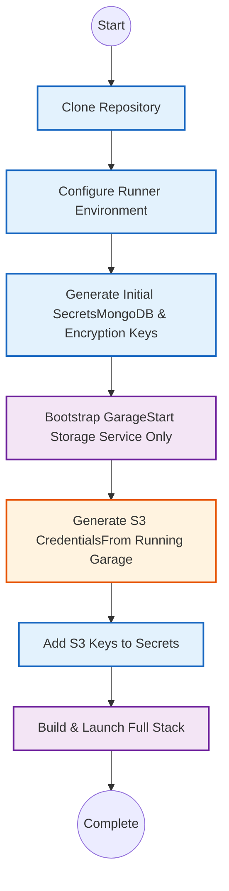

# Core Installation (Docker Compose)

This guide covers the setup of the base application using Docker Compose, including the application logic, databases (MongoDB/Solr), and object storage (Garage).

!!! abstract "Quick Overview"
    This installation requires a **two-phase setup** because the S3 storage service must generate credentials before the main application can start.

    **Time required:** ~15 minutes
    **Difficulty:** Intermediate

---

## Prerequisites

Ensure your environment meets these requirements before beginning:

=== "Required"

    - **Git** - Version control system
    - **Just** - Command runner ([installation guide](https://github.com/casey/just#installation))
    - **Docker** & **Docker Compose** - Container runtime
    - **Bash-compatible terminal** - For running commands

=== "Optional"

    - **Nix** - For development environment isolation (not required for standard installation)

---

## Installation Overview

The installation follows a specific sequence because Garage (S3 storage) must generate credentials before other services can connect to it:



---

## Step 1: Clone Repository

Clone the project repository and navigate into it:

```bash
git clone git@github.com:sdsc-ordes/debates-analytics.git
cd debates-analytics
```

---

## Step 2: Configure Runner Environment

The `just` command runner requires configuration to locate the API endpoint.

1. Copy the template environment file:

    ```bash
    cp .env.local.tmpl .env
    ```

2. Verify the contents (should already be correct):

    ```ini title=".env"
    OPENAPI_URL=http://localhost:8082/openapi.json
    CONTAINER_MGR=docker
    ```

!!! info "About this file"
    This `.env` file at the project root configures the `just` task runner, not the application itself.

---

## Step 3: Generate Initial Secrets

In this step, you'll create passwords and encryption keys. **Note:** S3 credentials will be added later.

### 3.1 Navigate to Deployment Directory

```bash
cd deploy/compose/
```

### 3.2 Initialize Configuration Files

```bash
cp .env.secrets.tmpl .env.secrets
cp .env.tmpl .env
```

### 3.3 Generate Secure Random Keys

Run these commands to generate cryptographically secure keys:

```bash
# Generate a 32-byte hex string for S3_SECRET_KEY (optional now, can regenerate)
openssl rand -hex 32

# Generate 4-byte hex strings for MongoDB passwords
openssl rand -hex 4  # For MONGO_PASSWORD
openssl rand -hex 4  # For MONGO_EXPRESS_PASSWORD
```

!!! tip "Save your output"
    Copy each generated value immediately—you'll need them in the next step.

### 3.4 Update Secrets File (Part 1)

Open `deploy/compose/.env.secrets` in your text editor and add the MongoDB and Hugging Face values.

```ini title="deploy/compose/.env.secrets"
# --- MongoDB Configuration ---
MONGO_USER=admin
MONGO_PASSWORD=

# --- MongoDB Admin Interface ---
MONGO_EXPRESS_USER=admin
MONGO_EXPRESS_PASSWORD=

# --- Hugging Face API ---
HF_TOKEN=

# --- S3 Storage (Leave blank for now) ---
S3_ACCESS_KEY=
S3_SECRET_KEY=
```

!!! warning "S3 Keys"
    **Do not** fill in `S3_ACCESS_KEY` or `S3_SECRET_KEY` yet. These will be generated in the next step.

---

## Step 4: Bootstrap Garage Storage

Garage must be running before it can generate S3 credentials.

### 4.1 Return to Project Root

```bash
cd ../../  # Back to debates-analytics/
```

### 4.2 Start Garage Service

```bash
just up garage
```

Wait for the confirmation message: `Container garage Started`

### 4.3 Generate S3 Key Pair

Execute this command to create new S3 credentials:

```bash
just compose exec garage garage key create app-key
```

### 4.4 Capture the Credentials

The output will look like this:

```plaintext hl_lines="2 3"
==== ACCESS KEY INFORMATION ====
Key ID:              GK8a1b2c3d4e5f...
Secret key:          123456789abcdef...
Can access bucket(s):  ALL
Can perform action(s):  ALL
Associated user:       -
```

!!! important "Copy both values"
    - **Key ID** → This becomes your `S3_ACCESS_KEY`
    - **Secret key** → This becomes your `S3_SECRET_KEY`

---

## Step 5: Complete Secrets Configuration

### 5.1 Add S3 Credentials

Open `deploy/compose/.env.secrets` again and add the S3 credentials you just generated:

```ini title="deploy/compose/.env.secrets" hl_lines="2-3"
# --- S3 Storage Configuration ---
S3_ACCESS_KEY=GK8a1b2c3d4e5f...
S3_SECRET_KEY=123456789abcdef...
```

### 5.2 Verify Complete Configuration

Your `.env.secrets` file should now have **all** values filled in:

- [x] `MONGO_USER` and `MONGO_PASSWORD`
- [x] `MONGO_EXPRESS_USER` and `MONGO_EXPRESS_PASSWORD`
- [x] `HF_TOKEN`
- [x] `S3_ACCESS_KEY` and `S3_SECRET_KEY`

---

## Step 6: Build and Launch

With all secrets configured, you can now start the complete application stack.

### 6.1 Restart Garage

Restart Garage to ensure it picks up any configuration changes:

```bash
just compose restart garage
```

### 6.2 Build Application Images

```bash
just build
```

!!! note "First-time build"
    This step may take several minutes on first run as Docker downloads and builds all required images.

### 6.3 Start All Services

```bash
just up
```

### 6.4 Verify Installation

Once all containers are running, verify access to the services:

| Service | URL | Credentials |
|---------|-----|-------------|
| **Frontend** | [http://localhost:3000](http://localhost:3000) | None |
| **API Documentation** | [http://localhost:8082/docs](http://localhost:8082/docs) | None |
| **Application Logs** | [http://localhost:8080/logs](http://localhost:8080/logs) | None |
| **Solr Admin** | [http://localhost:8983/solr](http://localhost:8983/solr) | None |
| **MongoDB Admin** | [http://localhost:8081](http://localhost:8081) | See `.env.secrets` |
| **Documentation** | [http://localhost:8001/sdsc-ordes](http://localhost:8001/sdsc-ordes) | None |

!!! success "Installation Complete!"
    Your application is now running! Access the frontend at [http://localhost:3000](http://localhost:3000)

---

## Next Steps

=== "Local Development"

    You're all set and ready to user the application: go to the [userguide](../userguide/roles.md)

=== "Server Deployment"

    Continue to [Server Configuration](server.md) to deploy on a production server.

---

## Getting Help

!!! question "Need assistance?"

    - **Issues:** [GitHub Issues](https://github.com/sdsc-ordes/debates-analytics/issues)
    - **Documentation:** This site you're reading!