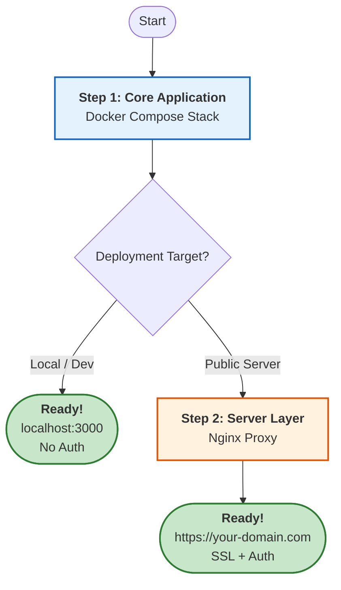

# Installation Overview

The application is containerized using Docker. Deployment follows a layered approach: the **Core Application** (Step 1) is required for everyone, while the **Server Layer** (Step 2) is an optional add-on for public hosting.

---

## Architecture & Installation Path

You generally only need to decide if you are testing locally or deploying to a server.



---

## 1. Core Application (Required)
**For:** Development, Testing, Local Use.

This sets up the full application stack (Frontend, Backend, Database, Search, S3).

* **Access:** `http://localhost:3000`
* **Auth:** None (Open access)
* **Time:** ~15 minutes

[:octicons-arrow-right-24: Start Core Installation](core.md){ .md-button .md-button--primary }

## 2. Server Layer (Optional)
**For:** Public hosting, Sharing with users.

Adds a security layer on top of the Core Application. You must complete Step 1 first.

* **Adds:** Nginx, SSL/TLS (HTTPS), Basic Authentication.
* **Access:** `https://your-domain.com`
* **Time:** +20 minutes

[:octicons-arrow-right-24: Configure Server Layer](server.md){ .md-button }

---

## Technical Comparison

| Feature | Local (Step 1 only) | Server (Step 1 + 2) |
| :--- | :--- | :--- |
| **URL** | `localhost:3000` | `https://your-domain.com` |
| **Security** | None (HTTP) | SSL/TLS (HTTPS) |
| **Auth** | Open Access | Role-based (Editor/Reader) |
| **Use Case** | Development | Production / Sharing |

---

## Prerequisites

Ensure you have these installed before starting:

* **Docker** & **Docker Compose**
* **Git**
* **Just** command runner ([installation guide](https://github.com/casey/just#installation))

!!! tip "For Server Deployment"
    You will also need a **domain name** (DNS configured) and **SSL certificates** ready.

---

## Stack Components

The application is composed of the following services:

| Service | Technology | Role |
| :--- | :--- | :--- |
| **Frontend** | SvelteKit | User Interface |
| **Backend** | FastAPI | REST API |
| **Job Queue** | Redis | Managing Async Workers |
| **Data** | MongoDB | Document Storage |
| **Search** | Apache Solr | Full-text indexing |
| **Storage** | Garage (S3) | Media & File storage |
| **Proxy** | Nginx | Security & Routing (Server only) |

```
