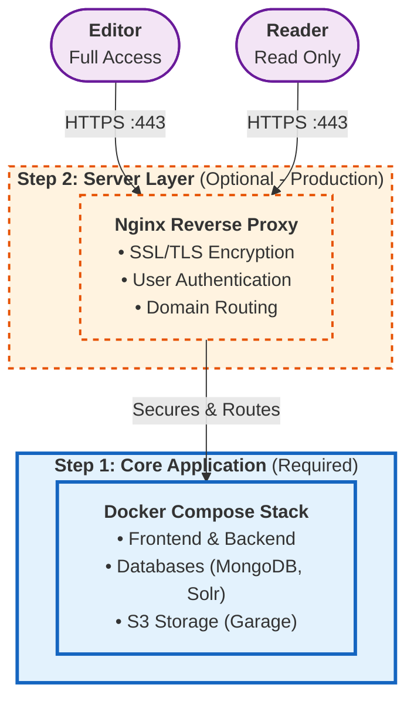
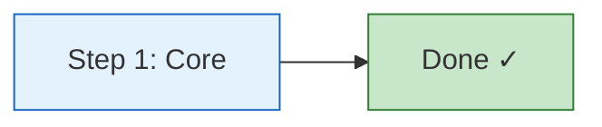
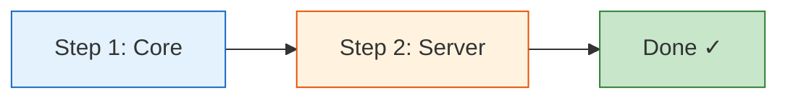

# Installation Overview

Choose your installation path based on your deployment environment. The application uses Docker for consistent, containerized deployment across all platforms.

---

## Installation Architecture

---

## Two-Step Setup

=== "Step 1: Core Application"

    **What:** Base application with all services
    **When:** Required for all deployments
    **Time:** ~15 minutes

    Includes:

    - Frontend (SvelteKit)
    - Backend API (FastAPI)
    - MongoDB database
    - Solr search engine
    - S3 object storage (Garage)

    **Access:** `http://localhost:3000` (no authentication)

    [:octicons-arrow-right-24: Start Core Installation](core.md)

=== "Step 2: Server Configuration"

    **What:** Security layer for public sharing
    **When:** Optional - for server deployments
    **Time:** ~20 minutes

    Adds:

    - Nginx reverse proxy
    - SSL/TLS encryption (HTTPS)
    - User authentication (Editor/Reader roles)
    - Domain configuration

    **Access:** `https://your-domain.com` (requires authentication)

    [:octicons-arrow-right-24: Configure Server](server.md)

---

## Choose Your Installation Path

### :material-laptop: Local Installation

**Best for:** Testing, development, or single-user access

**What you get:**

- Full application running on `localhost:3000`
- No authentication required
- No SSL/HTTPS

**Next steps:**

1. Complete [Step 1: Core Installation](core.md)
2. Access at `http://localhost:3000`

---

### :material-server-network: Server Deployment

**Best for:** Sharing with others via a public URL

**What you get:**

- Application accessible via your domain
- HTTPS with SSL/TLS certificates
- User authentication (Editor/Reader roles)
- Basic security for public sharing

**Next steps:**

1. Complete [Step 1: Core Installation](core.md)
2. Continue to [Step 2: Server Configuration](server.md)

---

## Key Differences

| Feature | Local Installation | Server Deployment |
|---------|-------------------|-------------------|
| **Access** | `localhost:3000` | `https://your-domain.com` |
| **Protocol** | HTTP | HTTPS (SSL/TLS) |
| **Authentication** | None | Role-based (Editor/Reader) |
| **Setup Time** | ~15 min | ~35 min (both steps) |
| **Use Case** | Local testing, development | Sharing with others |

---

## Prerequisites

Before starting, ensure you have:

- **Docker** & **Docker Compose** installed
- **Git** for cloning the repository
- **Just** command runner ([installation guide](https://github.com/casey/just#installation))

!!! tip "Server Deployment Only"
    For server deployment, you'll also need:

    - A domain name with DNS configured
    - SSL/TLS certificates (e.g., from Let's Encrypt)
    - Apache2 utilities for password generation

---

## What's Included

The complete stack consists of:

| Component | Technology | Purpose |
|-----------|------------|---------|
| **Frontend** | SvelteKit | User interface |
| **Backend API** | FastAPI | Application logic & REST API |
| **Database** | MongoDB | Document storage |
| **Search** | Apache Solr | Full-text search |
| **Object Storage** | Garage (S3) | File uploads & media |
| **Reverse Proxy** | Nginx | SSL, auth, routing (server only) |
| **Logs** | Dozzle | Container log aggregation |
| **Documentation** | MkDocs | This documentation site |

---

## Quick Start

Ready to begin? Start with the core installation:

-   :material-rocket-launch:{ .lg .middle } **Get Started**

    ---

    Follow the step-by-step core installation guide to get your application running.

    [:octicons-arrow-right-24: Core Installation](core.md)

---

## Need Help?

!!! question "Questions or issues?"

    - **Issues:** [GitHub Issues](https://github.com/sdsc-ordes/debates-analytics/issues)
    - **Documentation:** Continue reading this guide